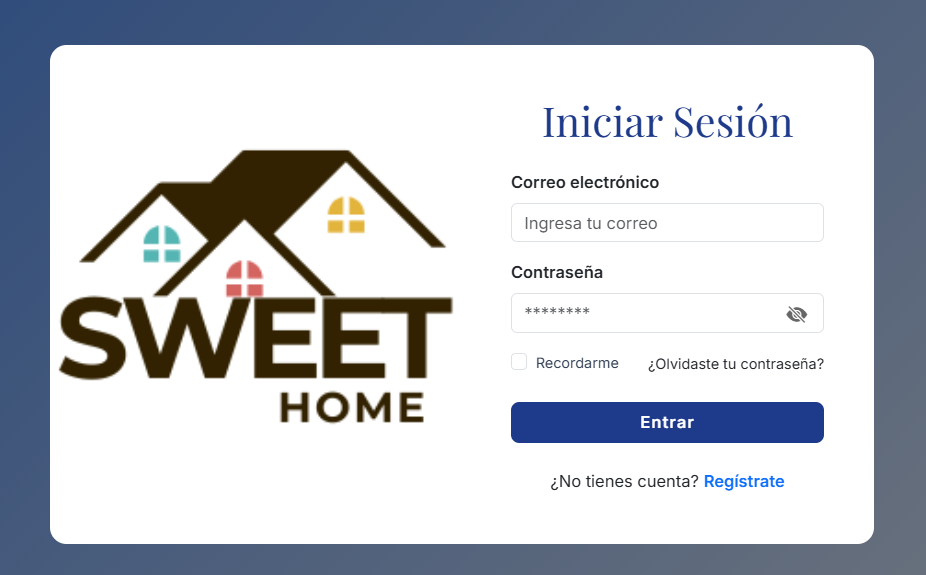
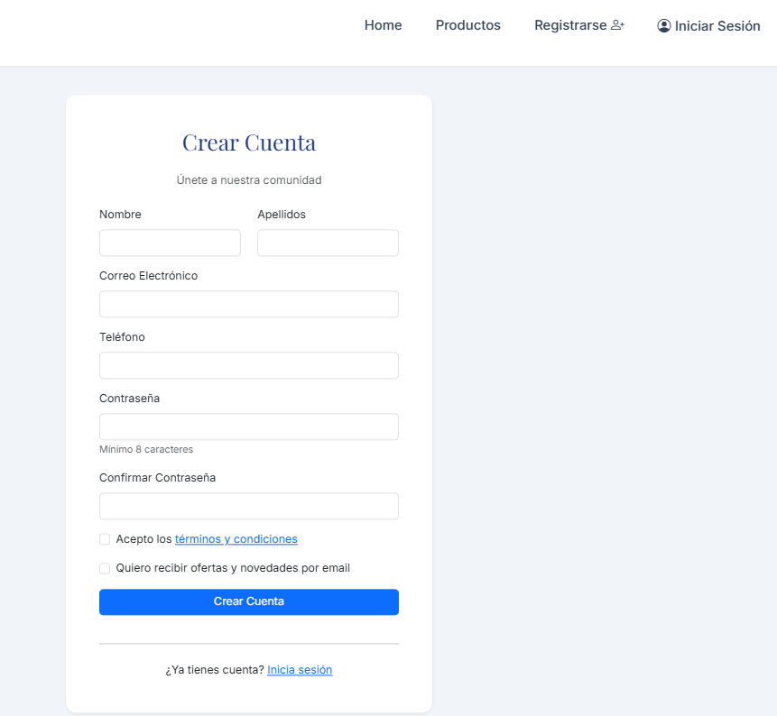
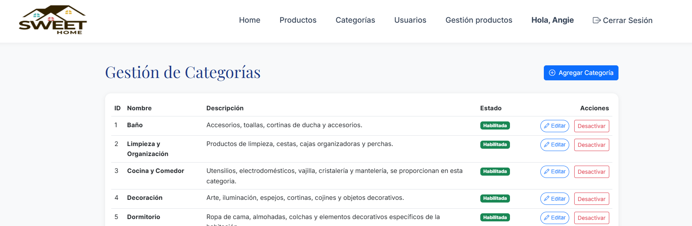
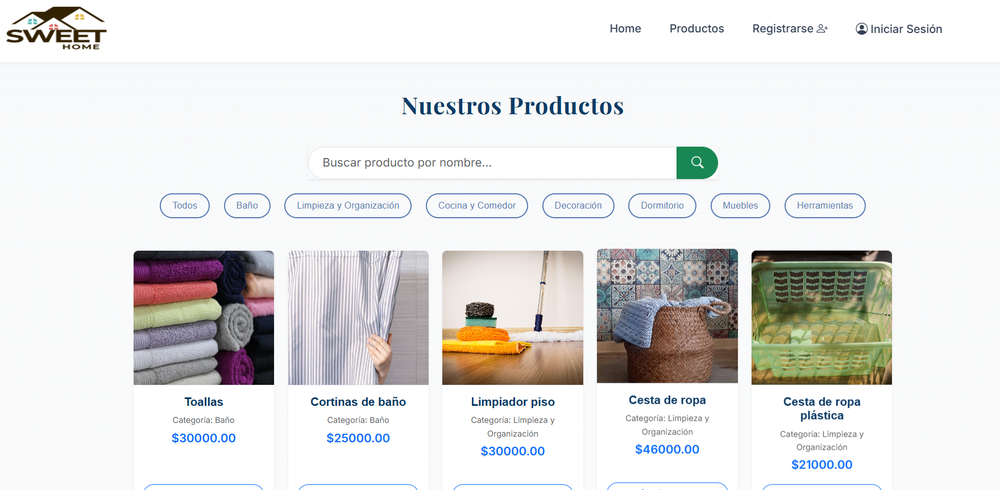
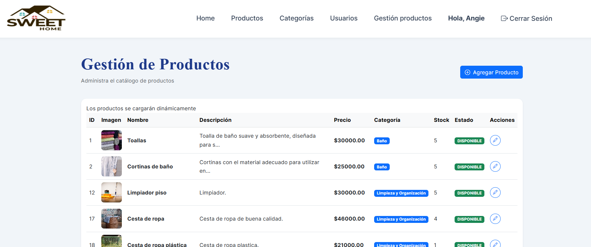
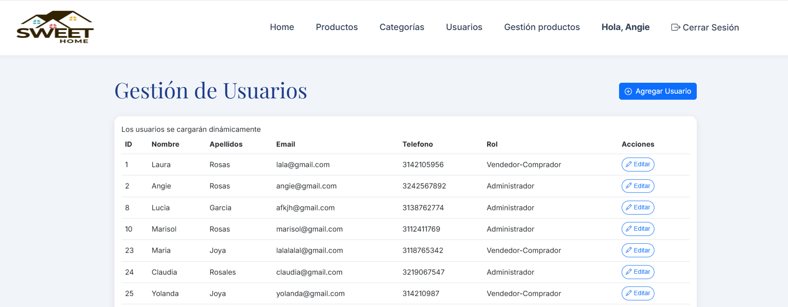

# 🏡 Sweet Home - Sistema de Venta de Garage  

**Spring Boot + JavaScript + MySQL**  

Sweet Home es una aplicación web para la **compra y venta de artículos usados**, tipo “venta de garage”.  
Permite a los usuarios **publicar productos**, **comunicarse con vendedores** y **gestionar pedidos** fácilmente desde sus dispositivo.  

---

## Vista Previa del Proyecto  

| Página Principal | Login | Registrarse como usuario |
|------------------|-----------------------|----------------------|
|  |  |  |


| Gestión de categorías | Catálogo de Productos | Gestión de Productos |
|------------------|-----------------------|----------------------|
|  |  |  |

| Gestión de usuarios | 
|----------|
|  | 

---

## Características Principales  

-Gestión de Productos
-Pedidos
-Búsqueda Avanzada — Filtra por nombre, categoría
-Comunicación Directa — Contacto rápido entre comprador y vendedor  
-Diseño Responsive 
-Seguridad JWT — Autenticación y control de acceso con Spring Security  
---

##  Tabla de Contenido
1. [Instalación y Configuración](#instalación-y-configuración)     
2. [Tecnologías Utilizadas](#tecnologías-utilizadas)  
3. [Estructura del Proyecto](#️estructura-del-proyecto)
4. [Arquitectura de la BD](#️modelo-entidad-relacion)
5. [Equipo de Desarrollo](#equipo-de-desarrollo)  


---

## Instalación y Configuración

###  Requisitos Previos  
Asegúrate de tener instalado:  
-  **Java 17 o superior** – [Descargar](https://www.oracle.com/java/technologies/javase/jdk17-archive-downloads.html)  
-  **Spring Boot 3.5.5**  
-  **MySQL** – [Descargar](https://dev.mysql.com/downloads/)    
-  **Git** – [Descargar](https://git-scm.com/)  


---

### Instalación Paso a Paso

####  Clonar el Repositorio  
```bash
git clone https://github.com/LauraRosas10/SweetHome.git
cd SweetHome
```


### Configurar Backend (Spring Boot + MySQL)

Crear la base de datos ejecutando el script SQL:

información de la BD/sweet_home.sql


Editar el archivo application.properties del Backend con tus credenciales:
```bash
spring.datasource.url=jdbc:mysql://localhost:3306/sweet_home_db?serverTimezone=UTC
spring.datasource.username=<usuario>
spring.datasource.password=<contraseña>
```

Ejecutar el backend.

Ejecutar frontend.


### Ejecución del Proyecto
Puertos:
Backend	http://localhost:8080

Frontend http://localhost:5500


### Tecnologías Utilizadas

- Backend:

* Java 17 
* Spring Boot 3.5.5
* Spring Security + JWT
* Maven
* MySQL

- Frontend

JavaScript Vanilla (ES6)
HTML5 + CSS3 + Bootstrap 5


### Estructura del Proyecto
```bash
SweetHome/
├── Backend/
│    ├─ src/main/java/uis/edu/entorno/backend/
│    │   ├─ config/
│    │   ├─ controlador/
│    │   ├─ modelo/
│    │   ├─ repositorio/
│    │   └─ servicio/
│    └─ src/main/resources/
│    ├─pom.xml 
├── Frontend/
│   │   ├── index.html
│   │   ├── styles.css
│   │   ├── login/
│   │   ├── categoria/
│   │   ├── gestion_producto/
│   │   ├── gestion_usuario/
│   │   ├── vista_producto/
│   │   ├── public/
│   │   └── barra_nav.js
│   │
│   └── start-all.bat
├── Informacion de la DB/
├── src_readme/
├── Documentos Sprints/
└── README.md
```


### Modelo entidad relacion


### Equipo de Desarrollo
Nombres:
Laura Rosas
Justin Galvis


